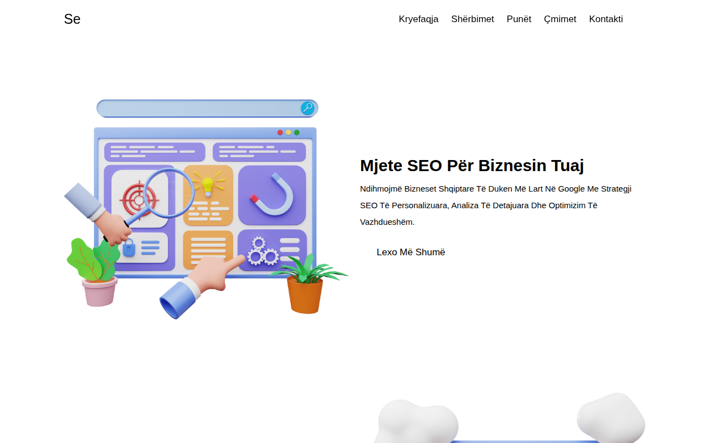

# Agjenci SEO

Faqe moderne dhe responsive për një agjenci SEO / marketingu digjital — e përshtatur plotësisht në gjuhën shqipe. Përfshin seksione për kryefaqen, shërbimet, punët, çmimet, kontaktin, buletinin dhe këmbën e faqes, me modalitet të errët dhe dizajn plotësisht responsive.

## 🌐 Demo live

👉 **https://erionnezha.github.io/Seo-Agency/**

## 🚀 Si ta hapni lokalisht

1. Shkarkoni ose klononi këtë repo.
2. Hapni skedarin `index.html` në shfletues — nuk kërkohet server apo instalim.

## 🛠️ Teknologjitë

- HTML5
- CSS3 (dizajn responsive, modalitet i errët)
- JavaScript (menu mobile, ndërrues teme, tregues scroll-i)
- Font Awesome (ikonat)

## 📄 Licenca

Ky projekt është nën licencën MIT — shihni skedarin [LICENSE](LICENSE).

---

# SEO Agency

A modern, responsive website for an SEO / digital marketing agency — fully localized in Albanian. Includes home, services, work, pricing, contact, newsletter and footer sections, with a dark theme toggle and a fully responsive layout.

## 🌐 Live demo

👉 **https://erionnezha.github.io/Seo-Agency/**

## 🚀 Run locally

1. Download or clone this repository.
2. Open `index.html` in your browser — no server or installation required.

## 🛠️ Technologies

- HTML5
- CSS3 (responsive design, dark mode)
- JavaScript (mobile menu, theme toggle, scroll indicator)
- Font Awesome (icons)

## 📄 License

This project is licensed under the MIT License — see the [LICENSE](LICENSE) file.
